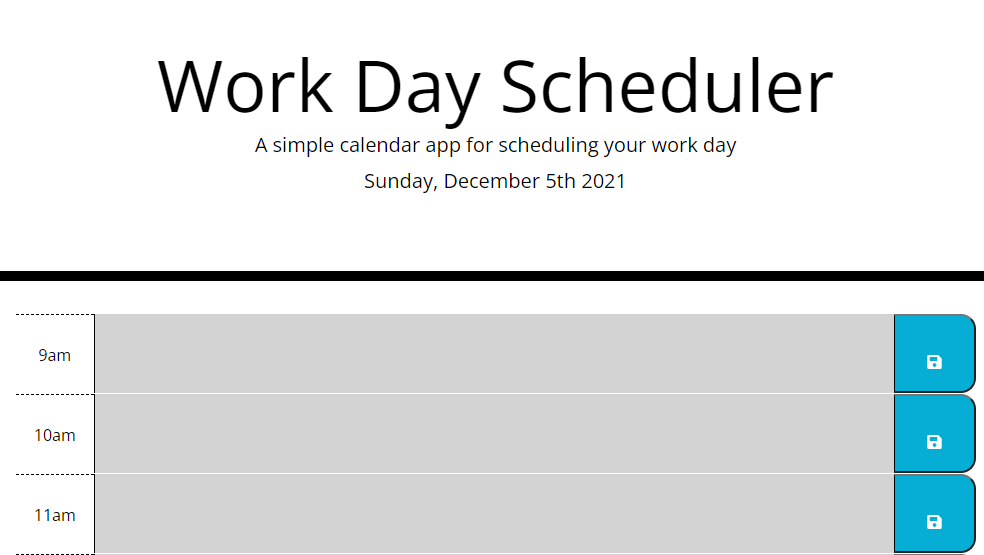

# work-day-scheduler

## Acceptance Criteria
- create a scheduler
- display current date and time
- time blocks for bussiness hours
- time blocks color-coded for past present and future
- enter information into time block
- save button and to local storage

## links
- [wibsite] [ https://afebre1027.github.io/work-day-scheduler/]
- [github repo] [https://github.com/afebre1027/work-day-scheduler]
